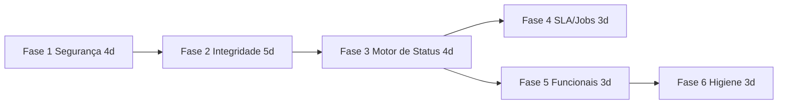

# Plano de Melhorias e Correções — Sistema de Protocolos

**Base:** [AUDITORIA-SISTEMA-PROTOCOLOS.md](AUDITORIA-SISTEMA-PROTOCOLOS.md) (2026-07-18)
**Organização:** 6 fases ordenadas por risco. Cada item referencia o achado da auditoria (C=crítico, A=alto, M=médio). Estimativas em dias úteis de trabalho focado.

## ✅ STATUS: IMPLEMENTADO (2026-07-18)

Todas as 6 fases foram implementadas no commit desta data, com os seguintes desvios conscientes do plano original:

- **1.1**: em vez de URL assinada, o download usa auth híbrida (cookie de servidor OU de cidadão, com checagem de posse/escopo) — ``/`<iframe>` same-origin enviam cookie normalmente.
- **5.5**: a rota admin `POST /:id/evaluate` foi **removida** (não tinha nenhum consumidor no frontend; o caminho legítimo é `POST /api/internal/evaluations` do bot, que valida posse e deduplica).
- **5.6**: `send-payment-info` agora entrega por um canal REAL (interação do protocolo visível ao cidadão no portal/bot) e a resposta é honesta; integração de e-mail continua pendente (o canal de e-mail de notificações ainda é TODO no repo).
- **5.8**: o índice parcial de unicidade no banco NÃO foi criado (o escopo de unicidade varia por serviço — inexprimível num índice único); implementado o fail-closed + a validação segue aplicativa.
- **6.3**: constantes canônicas criadas e aplicadas nos caminhos de criação (frontend não dependia dos valores antigos); migração de dados históricos NÃO foi executada (ações antigas permanecem no banco).
- **6.5**: consolidação física dos 7 routers não foi feita (risco > benefício agora); a rota sombreada foi corrigida por reordenação.
- **Extra**: o job `initRevertExpiredDelegationsJob` existia mas nunca era registrado — passou a ser iniciado no boot junto com o novo `sla-monitor.job`.

**Pendências operacionais (exigem a VPS/banco):** rodar `prisma migrate deploy` (2 migrations novas: unique composto de número por tenant + unique de avaliação com dedup), e rodar o smoke `npm run smoke:tenant:isolation`. O plano de testes da seção abaixo segue válido como backlog de QA.

---

## Fase 1 — Segurança e Vazamento de Dados (imediato) — ~4 dias

> Nada aqui muda comportamento legítimo; só fecha portas. Pode ir para produção em um único deploy.

### 1.1 Autenticar download de documentos (C1) — 1d
- Adicionar middleware híbrido na rota `GET /:protocolId/documents/:documentId/download` que aceite **cookie admin OU cookie cidadão** (cidadão só se `protocol.citizenId === citizen.id`; admin com escopo da Fase 2).
- Remover `Access-Control-Allow-Origin: *` (mesma origem via nginx não precisa de CORS). Igual nos downloads do cidadão (M12).
- Frontend: conferir que ``/`<iframe>` já enviam cookie (same-origin — devem enviar); se houver uso cross-origin, migrar para URL assinada com expiração (query token HMAC de 5 min).
- **Aceite:** request sem cookie → 401; cidadão A não baixa documento do cidadão B.

### 1.2 Escapar HTML nos PDFs (C2) — 0,5d
- Criar `escapeHtml()` utilitário e aplicar em TODA interpolação de `/report` e `/timeline/export` (title, nomes, mensagens, notes, fileName, description).
- Lançar Chromium com `--proxy-server='direct://' --proxy-bypass-list='<-loopback>'` ou route-block de rede no contexto para impedir requests externos.
- **Aceite:** protocolo com título `` gera PDF com o texto literal.

### 1.3 Escopo de leitura nas rotas abertas (A2, A3) — 2d
- Criar helper único `assertProtocolAccess(user, protocol)` (mesma regra do `GET /:id`: USER → atribuído a ele — considerando os DOIS campos de atribuição; MANAGER/COORDINATOR → mesmo departamento; ADMIN+ → tudo) e aplicar em: `/:id/history`, `/:id/assignments`, `/:id/report`, `/:id/timeline/export`, `/by-number/:number`, `/:id/status`, `/:id/comments`, `/:id/complete`, `/:id/reopen`, `/:id/evaluate`, `/:id/send-payment-info`.
- `GET /department/:departmentId`, `/stats/:departmentId`, `/citizen/:citizenId`, `/workload-stats`: exigir `requireMinRole(MANAGER)` + validar `user.departmentId === departmentId` (exceto ADMIN+).
- `GET /`: adicionar branch para COORDINATOR (= escopo de departamento); MANAGER sem departmentId → lista vazia + log de erro de cadastro.
- `GET /secretaria/:departmentId` com `scope=department`: validar departamento do usuário (exceto ADMIN+).
- **Aceite:** USER de secretaria X recebe 403 em protocolo da secretaria Y em todas as rotas listadas.

### 1.4 Eliminar spoofing de ator (C7) — 0,5d
- `PATCH /:id/status` e `POST /:id/comments`: **ignorar** `userId` do body; usar sempre `authReq.userId`.
- **Aceite:** body com `userId` de terceiro registra o autor real no histórico.

---

## Fase 2 — Integridade de Dados e Numeração — ~5 dias

### 2.1 Unique composto de número por tenant (C3) — 1d
- Migration: `@@unique([tenantId, number])` no lugar de `number @unique` (backfill: garantir `tenantId` não-nulo nos existentes — já há normalização no seed).
- Ajustar `findByNumber` (`findUnique({ where: { number } })` → `findFirst`, a extension escopa) e demais usos.
- **Aceite:** smoke `npm run smoke:tenant:isolation` + criar protocolo com mesmo número em 2 tenants.

### 2.2 Número sempre dentro da transação de criação (C4) — 1d
- Refatorar os 4 chamadores standalone para envolver geração+create numa `$transaction` passando `tx` (citizen-protocols, departments-tickets, tab-modules, protocol-simplified.service).
- No `generateNumberWithLock`: trocar `ORDER BY "createdAt" DESC` por `ORDER BY number DESC` e tratar tabela vazia com lock advisory por tenant (`pg_advisory_xact_lock(hashtext(tenantId))`), que também resolve a corrida do primeiro protocolo.
- Decidir M1 (reinício anual): recomendo reiniciar sequência ao virar o ano (`WHERE number LIKE '${year}-%'`); documentar no CLAUDE.md.
- **Aceite:** teste de concorrência (20 creates paralelos) sem erro de unique e sem furo de sequência.

### 2.3 Criação do cidadão transacional e alinhada ao module service (C5, A9 parcial) — 2d
- Reescrever `POST /api/citizen/protocols` para delegar ao `protocolModuleService.createProtocolWithModule` (como citizen-services e o bot já fazem), mantendo apenas o tratamento de multipart/arquivos na rota.
- Mover arquivos para o diretório do protocolo **após** o commit; em caso de falha, apagar os temporários.
- Corrigir M6 (validar `serviceId` obrigatório antes do `findFirst`) e M7 (try/catch no `JSON.parse` → 400).
- **Aceite:** derrubar o workflow de um serviço e criar protocolo → ou cria com workflow auto-gerado, ou falha SEM deixar protocolo órfão; retry do cidadão funciona.

### 2.4 Aprovação atômica (C6) — 1d
- Em `approveProtocol`: (1) validar a transição com o engine ANTES de qualquer escrita (expor `validateTransition` público ou checar status atual + regra COM_DADOS); (2) executar ativação do `_meta` + materialização + update de status na MESMA transação (o engine já aceita rodar dentro de `$transaction`? Se não, ajustar `updateStatus` para aceitar `tx` opcional).
- **Aceite:** aprovar COM_DADOS em VINCULADO → erro claro e `customData._meta` intacto (`PENDING_APPROVAL`).

---

## Fase 3 — Um Único Motor de Status — ~4 dias

### 3.1 Completar a matriz de transições (A1) — 0,5d
- Adicionar `COORDINATOR` e `MANAGER` ao `TRANSITION_MATRIX` (proposta: iguais a USER + permissão de reabrir; ajustar com o produto).
- Remover os hardcodes: `approveProtocol`/`rejectProtocol` recebem e repassam o **role real** do aprovador; orquestrador usa um ator `SYSTEM` explícito (adicionar `'SYSTEM'` ao tipo `ActorRole` com bypass documentado, em vez de fingir ADMIN).
- **Aceite:** histórico registra o role verdadeiro; MANAGER consegue aprovar sem gambiarra.

### 3.2 Eliminar os bypasses (C8, A10) — 1,5d
- `POST /:id/complete`: reimplementar via `protocolStatusEngine.updateStatus` + `completeSLA` (manter a auto-categorização como pós-hook).
- Deletar `protocolServiceSimplified.updateStatus` (verificar chamadores; migrar para o engine).
- Adicionar comentário-contrato no model: mudanças de `status` só via engine (e, se quiser garantir, um check no Prisma middleware/extension que loga updates de status vindos de fora do engine).
- **Aceite:** `grep` por `status: ProtocolStatus\.` em updates diretos retorna só o engine.

### 3.3 Reabertura consistente (A12) — 1d
- Engine: ao sair de status terminal (reopen), setar `concludedAt: null` na própria transação.
- Rota `/reopen`: remover o history manual duplicado (o engine já registra; enriquecer via `metadata`), englobar criação de stages + pendências na transação.
- **Aceite:** reabrir via PATCH status (ADMIN) limpa `concludedAt`; histórico tem UMA entrada de reabertura.

### 3.4 Correções menores do engine (M2, M3, M14) — 1d
- `CANCELADO`: usar campo próprio ou manter `concludedAt` mas rotular corretamente nos relatórios ("Data de Encerramento"); decisão simples, aplicar nos 2 PDFs.
- Histórico de ator CITIZEN: gravar `metadata.citizenId` sempre (hoje se perde) — ou adicionar coluna `citizenId` no history.
- Remover os hooks vazios `activateModuleEntity`/etc. (código morto que sugere comportamento inexistente).

---

## Fase 4 — SLA e Automação — ~3 dias

### 4.1 Job de SLA (A5) — 1,5d
- Criar `sla-monitor.job.ts` (node-cron ou BullMQ repeatable, diário às 06h): para cada tenant ativo (`forEachActiveTenant`), `updateMany` em lote marcando `isOverdue`/`daysOverdue` (uma query SQL, não N updates) e disparando notificação para protocolos que acabaram de atrasar.
- Aproveitar o job para chamar `processPendingReminders` e `expireStalePendings` (hoje órfãos).
- **Aceite:** protocolo com `expectedEndDate` ontem aparece como atrasado no dashboard sem intervenção manual.

### 4.2 SLA finalizado em toda conclusão (A5) — 0,5d
- Mover `completeSLA` para dentro do engine (hook pós-transação quando novo status é terminal), removendo a chamada do orquestrador.
- **Aceite:** concluir por qualquer caminho seta `actualEndDate`.

### 4.3 Tenant real nas consultas de SLA (A5) — 0,5d
- Remover o parâmetro `tenantId` fantasma (`where.protocol = {}`) — a extension já escopa; ou filtrar de verdade se a chamada vier de contexto de plataforma. `calculateSLAStats`: trocar `findMany` + filter em memória por `groupBy`/`count`s.

---

## Fase 5 — Correções Funcionais — ~3 dias

| Item | Achado | Ação | Est. |
|---|---|---|---|
| 5.1 | A6 | Mover `GET /module/:moduleType/pending` para ANTES de `/module/:departmentId/:moduleType` (ou renomear para `/module-pending/:moduleType`) | 0,25d |
| 5.2 | A7 | `listByDepartment`: whitelist de filtros (`status`, `moduleType`, `assignedUserId`, datas) — nunca espalhar `req.query` no `where` | 0,5d |
| 5.3 | A8 | Adicionar `adminAuthMiddleware` no DELETE de documento (e testar que ADMIN consegue deletar) | 0,25d |
| 5.4 | A4 | Listagens/filtragens de "meus protocolos" passam a usar `OR: [{assignedUserId}, {currentAssignedUserId}]` (GET `/` e filtro `assignedUserId`) — padrão já usado em `/secretaria/` | 0,5d |
| 5.5 | A11 | Migration `@@unique([protocolId])` em evaluations (dedup antes: manter a mais recente); rota admin de avaliação passa a exigir contexto do cidadão ou é removida; range 1–5 validado no service | 0,75d |
| 5.6 | M5 | `send-payment-info`: integrar com o SMTP server (fila BullMQ) OU responder honestamente "registrado no protocolo" até integrar; nunca logar chave PIX | 0,5d |
| 5.7 | M8 | Cancelamento do cidadão: bloquear apenas por interações humanas (`authorType='SERVER'` e `isInternal=false`?) e pendências ABERTAS; revisar com produto | 0,5d |
| 5.8 | M9 | Unicidade: fail-closed em erro (negar com mensagem de "tente novamente") + constraint parcial no banco quando escopo CITIZEN (`UNIQUE (citizenId, serviceId) WHERE status IN (ativos)` via migration SQL) | 0,5d |
| 5.9 | M10 | `incoming-calls`: marcar chamados com flag própria (`origin: 'ADMIN_CALL'` em customData ou coluna) em vez de `createdById != null`; stats num único `groupBy` | 0,5d |

---

## Fase 6 — Robustez e Higiene — ~3 dias

- **6.1 PDF sob controle (M4):** util `renderPdf(html)` compartilhado com `try/finally` no `browser.close()`, semáforo de concorrência (máx. 2 browsers) e reuso de instância. 0,5d
- **6.2 Logs (Baixos):** varrer `console.log` do núcleo de protocolos → `logger.debug` do Winston com redaction de CPF/PII; remover blocos de debug de upload. 1d
- **6.3 Ações de histórico padronizadas (M13):** enum/constante única de actions (`PROTOCOL_CREATED`, `STATUS_CHANGED`, ...) + script de migração dos valores antigos. 0,5d
- **6.4 Uploads (Baixos):** trocar `fs.renameSync` por `fs.promises.rename` com fallback copy+unlink (EXDEV); reportar ao cidadão arquivos não mapeados na resposta da criação (hoje descartados em silêncio). 0,5d
- **6.5 Router unificado:** consolidar a montagem dos 7 routers de `/api/protocols` num index único com ordem documentada e teste de rotas sombreadas (regressão para A6). 0,5d

---

## Ordem de Execução e Dependências

- **Fases 1 e 5.1–5.3** são de baixo risco de regressão e podem ser um único PR inicial ("fecha portas").
- **Fase 2** exige migrations (2.1, 5.5, 5.8) — rodar com `MIGRATE_DATABASE_URL` e testar o smoke de isolamento de tenant.
- **Fase 3** é a de maior risco de regressão (muda semântica de permissão) — cobrir com testes antes.

## Plano de Testes Mínimo (antes da Fase 3)

1. **Transições:** tabela-verdade automatizada `role × statusAtual × novoStatus` contra o engine (hoje não existe nenhum teste disso).
2. **Concorrência de numeração:** 20 criações paralelas por tenant, 2 tenants.
3. **Fluxo cidadão E2E:** criar (com e sem workflow no serviço) → pendência → resolver → aprovar → avaliar → tentar avaliar de novo.
4. **Escopo:** matriz `role × rota` esperando 200/403 (cobre Fase 1.3).
5. **Reabertura:** restart e append; conferir `concludedAt`, histórico único, SLA.

## Métricas de Sucesso

- Zero rotas de protocolo acessíveis sem auth (varredura automatizada de rotas × middlewares).
- Zero updates diretos de `status` fora do engine (grep no CI).
- Dashboards de SLA mostrando atrasos reais (job rodando).
- Nenhum erro de unique de `number` nos logs por 30 dias.
