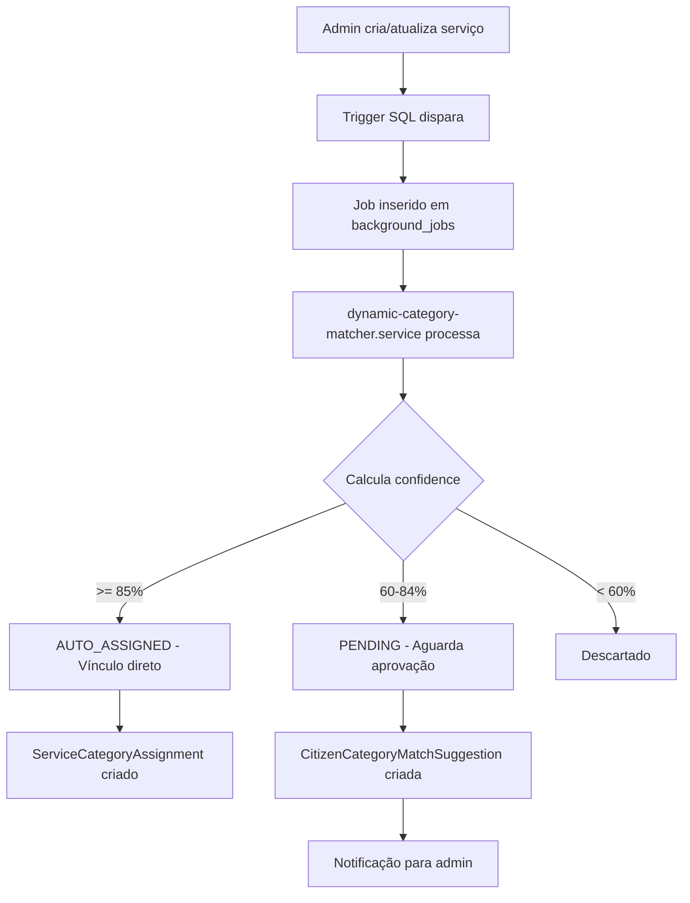
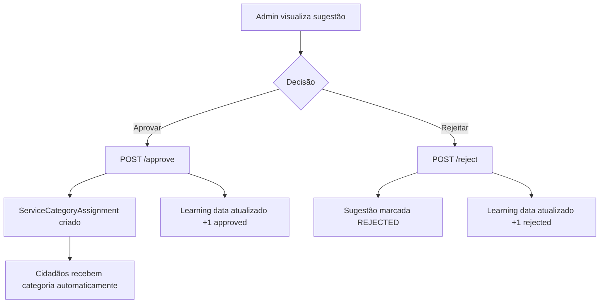

# 🎯 Sistema de Aprovação de Sugestões de Categorização

## 📋 Índice

1. [Visão Geral](#visão-geral)
2. [Arquitetura](#arquitetura)
3. [Fluxo de Funcionamento](#fluxo-de-funcionamento)
4. [Componentes do Sistema](#componentes-do-sistema)
5. [Interfaces de Usuário](#interfaces-de-usuário)
6. [API Endpoints](#api-endpoints)
7. [Guia de Uso](#guia-de-uso)
8. [Troubleshooting](#troubleshooting)

---

## 🎯 Visão Geral

O **Sistema de Aprovação de Sugestões de Categorização** é um componente inteligente que automatiza a vinculação entre serviços municipais e categorias cidadãs, permitindo que administradores revisem e aprovem sugestões geradas automaticamente pelo sistema.

### Objetivos

- ✅ **Automatizar categorização**: Reduzir trabalho manual de vincular serviços a categorias
- ✅ **Garantir precisão**: Permitir revisão humana antes de ativar vínculos
- ✅ **Aprendizado contínuo**: Sistema aprende com aprovações/rejeições
- ✅ **Transparência**: Mostrar detalhes do match para decisão informada

### Quando é usado?

O sistema entra em ação automaticamente quando:

1. **Novo serviço é criado** (manualmente pelo admin ou via IA)
2. **Serviço existente é atualizado** (nome, tipo, departamento)
3. **Admin solicita re-análise** manual de um serviço

---

## 🏗️ Arquitetura

### Componentes Backend

```
┌─────────────────────────────────────────────────────┐
│                 BACKEND (Node.js)                   │
├─────────────────────────────────────────────────────┤
│                                                     │
│  📝 Migration (20260127100000)                      │
│  └─ Cria 7 tabelas + trigger automático            │
│                                                     │
│  🔧 Services                                        │
│  ├─ dynamic-category-matcher.service.ts            │
│  │  └─ Análise inteligente (EXACT/PATTERN/SEMANTIC)│
│  └─ category-suggestions.routes.ts                 │
│     └─ API REST para aprovação                     │
│                                                     │
│  🗄️  Database (PostgreSQL)                          │
│  ├─ citizen_category_match_suggestions (Sugestões) │
│  ├─ service_category_assignments (Vínculos)        │
│  ├─ citizen_category_learning_data (ML)            │
│  └─ background_jobs (Fila assíncrona)              │
│                                                     │
└─────────────────────────────────────────────────────┘
```

### Componentes Frontend

```
┌─────────────────────────────────────────────────────┐
│                FRONTEND (React/Next.js)             │
├─────────────────────────────────────────────────────┤
│                                                     │
│  🎣 Hooks                                           │
│  └─ useCategorySuggestions.ts                      │
│     └─ Gerencia estado e API calls                 │
│                                                     │
│  🖼️  Components                                      │
│  ├─ CategorySuggestionModal.tsx                    │
│  │  └─ Modal de aprovação rápida                   │
│  └─ AdminSidebar.tsx                               │
│     └─ Badge de notificação                        │
│                                                     │
│  📄 Pages                                           │
│  └─ /admin/categorias/sugestoes/page.tsx          │
│     └─ Dashboard completo                          │
│                                                     │
└─────────────────────────────────────────────────────┘
```

---

## 🔄 Fluxo de Funcionamento

### 1. Criação/Atualização de Serviço



### 2. Aprovação Manual



---

## 🧩 Componentes do Sistema

### 1. Backend: dynamic-category-matcher.service.ts

#### Principais Funções

```typescript
// Analisa serviço e retorna matches
analyzeServiceForCategories(serviceId: string): Promise<ServiceAnalysis>

// Calcula score de match (0-100)
calculateMatchScore(service, tags, category): MatchResult | null

// Processa resultados (auto-assign ou sugestão)
processMatchResults(serviceId, matches, processedBy?): Promise<ProcessResult>

// Hook chamado pelo trigger
onServiceCreatedOrUpdated(serviceId: string): Promise<void>
```

#### Algoritmo de Matching

**Nível 1: EXACT (100% confiança)**
```typescript
if (category.exactPatterns.includes(service.moduleType)) {
  return 100;
}
```

**Nível 2: PATTERN (70-90% confiança)**
```typescript
for (const pattern of category.regexPatterns) {
  if (new RegExp(pattern.regex).test(service.name)) {
    return pattern.confidence || 80;
  }
}
```

**Nível 3: SEMANTIC (40-60% confiança)**
```typescript
let score = 0;

// Department match (30 pontos)
if (semanticRules.departments.includes(service.departmentCode)) {
  score += 30;
}

// Required tags (40 pontos se TODOS presentes)
if (allRequiredTagsPresent) {
  score += 40;
}

// Optional tags (20 pontos proporcionais)
score += (matchedOptional / totalOptional) * 20;

// Service type bonus (10 pontos)
if (typeMatches) {
  score += 10;
}

// Exclude tags (VETO)
if (hasExcludeTags) {
  return 0;
}

return score;
```

### 2. Backend: category-suggestions.routes.ts

#### Endpoints Implementados

| Método | Rota | Descrição |
|--------|------|-----------|
| GET | `/pending` | Lista sugestões pendentes (com filtros) |
| GET | `/service/:serviceId` | Sugestões de um serviço específico |
| GET | `/stats` | Estatísticas gerais |
| POST | `/:id/approve` | Aprova uma sugestão |
| POST | `/:id/reject` | Rejeita uma sugestão |
| POST | `/approve-multiple` | Aprovação em lote |
| POST | `/analyze-service/:serviceId` | Re-análise manual |

### 3. Backend: notifications.routes.ts (SSE)

Sistema de notificações em tempo real usando Server-Sent Events.

#### Endpoints SSE

| Método | Rota | Descrição |
|--------|------|-----------|
| GET | `/stream` | Conecta ao stream SSE de notificações |
| GET | `/connected-clients` | Estatísticas de clientes conectados |
| POST | `/test-broadcast` | Envia notificação de teste (dev only) |

#### Tipos de Eventos SSE

**CONNECTED**: Confirmação de conexão
```json
{
  "type": "CONNECTED",
  "data": {
    "message": "Conectado ao sistema de notificações",
    "clientId": "user-123-1234567890"
  },
  "timestamp": "2026-01-27T10:00:00Z"
}
```

**STATS_UPDATE**: Atualização de estatísticas
```json
{
  "type": "STATS_UPDATE",
  "data": {
    "pendingSuggestions": 15,
    "pendingProtocols": 42,
    "pendingCitizens": 8
  },
  "timestamp": "2026-01-27T10:00:00Z"
}
```

**NEW_CATEGORY_SUGGESTION**: Nova sugestão criada
```json
{
  "type": "NEW_CATEGORY_SUGGESTION",
  "data": {
    "serviceId": "uuid",
    "serviceName": "Cadastro de Produtor Rural",
    "categoryName": "Produtor Rural",
    "confidence": 85,
    "message": "Nova sugestão: Cadastro de Produtor Rural → Produtor Rural (85%)"
  },
  "timestamp": "2026-01-27T10:00:00Z"
}
```

**SUGGESTION_APPROVED**: Sugestão aprovada
```json
{
  "type": "SUGGESTION_APPROVED",
  "data": {
    "serviceId": "uuid",
    "serviceName": "Cadastro de Produtor Rural",
    "categoryName": "Produtor Rural",
    "message": "Categoria aprovada: Cadastro de Produtor Rural → Produtor Rural"
  },
  "timestamp": "2026-01-27T10:00:00Z"
}
```

### 4. Frontend: useCategorySuggestions.ts

#### Interface do Hook

```typescript
const {
  suggestions,        // Array de sugestões pendentes
  loading,           // Estado de carregamento
  error,             // Erro se houver
  stats,             // Estatísticas gerais
  refetch,           // Recarregar dados
  approveSuggestion, // Função de aprovação
  rejectSuggestion,  // Função de rejeição
  approveMultiple,   // Aprovação em lote
  getServiceSuggestions, // Buscar de serviço específico
  analyzeService     // Re-analisar serviço
} = useCategorySuggestions({
  departmentCode: 'AGRICULTURA',  // Opcional
  minConfidence: 70,              // Opcional
  autoRefresh: true,              // Auto-refresh
  refreshInterval: 30000          // Intervalo em ms
});
```

### 5. Frontend: useNotifications.ts (SSE)

Hook para receber notificações em tempo real via Server-Sent Events.

#### Interface do Hook

```typescript
const {
  connected,   // Status da conexão SSE
  stats,       // Estatísticas atualizadas em tempo real
  reconnect,   // Função para reconectar manualmente
  disconnect   // Função para desconectar
} = useNotifications();
```

#### Características

- **Reconexão Automática**: Até 5 tentativas com delay de 3s
- **Heartbeat**: Ping a cada 30s para manter conexão viva
- **Toast Automático**: Notificações visuais para eventos importantes
- **Integrado no AdminLayout**: Conecta automaticamente ao fazer login

#### Tratamento de Eventos

O hook processa automaticamente diferentes tipos de eventos:

- `CONNECTED`: Confirmação de conexão (silencioso)
- `STATS_UPDATE`: Atualiza contadores em tempo real
- `NEW_CATEGORY_SUGGESTION`: Toast com botão "Ver" que redireciona
- `SUGGESTION_APPROVED`: Toast de sucesso
- `TEST`: Toast informativo (desenvolvimento)

### 6. Frontend: CategorySuggestionModal.tsx

Modal exibido após criação de serviço com:

- ✅ Lista de sugestões pendentes
- ✅ Detalhes do match (padrões, confiança)
- ✅ Campo de notas de revisão
- ✅ Botões de aprovar/rejeitar individuais
- ✅ Fecha automaticamente quando todas processadas

### 7. Frontend: Dashboard (/admin/categorias/sugestoes)

Dashboard completo com:

- 📊 **Cards de Estatísticas**
  - Pendentes
  - Aprovadas
  - Auto-atribuídas
  - Rejeitadas

- 🔍 **Filtros**
  - Por departamento
  - Por confiança mínima

- 📋 **Tabela de Sugestões**
  - Checkbox para seleção múltipla
  - Detalhes do serviço e categoria
  - Badge de tipo de match
  - Badge de confiança
  - Ações de aprovar/rejeitar

- 📈 **Gráficos**
  - Estatísticas por departamento

---

## 🖥️ Interfaces de Usuário

### 1. Badge no Menu Lateral

**Localização**: Menu Admin > Gestão > "Sugestões de Categorização"

**Comportamento**:
- Badge aparece quando `pending > 0`
- Atualiza automaticamente a cada 30 segundos
- Cor vermelha para chamar atenção
- Número exibido: quantidade de sugestões pendentes

**Código**:
```tsx
{
  title: 'Sugestões de Categorização',
  href: '/admin/categorias/sugestoes',
  icon: Sparkles,
  minRole: 'COORDINATOR',
  badge: categoryStats?.pending ? categoryStats.pending.toString() : undefined
}
```

### 2. Dashboard Principal

**URL**: `/admin/categorias/sugestoes`

**Recursos**:
- Botão "Atualizar" (manual refresh)
- Botão "Aprovar X selecionadas" (aprovação em lote)
- Filtros de departamento e confiança
- Tabela responsiva
- Empty state amigável quando não há sugestões

### 3. Modal de Aprovação Rápida

**Quando aparece**:
- Após criar novo serviço
- Quando solicitar análise manual
- Pode ser invocado programaticamente

**Recursos**:
- Exibe múltiplas sugestões de uma vez
- Campo de notas opcional por sugestão
- Fecha automaticamente ao processar todas

### 4. Status de Categorização na Listagem de Serviços

**Localização**: `/admin/servicos`

Cada card de serviço agora exibe:

**Status Visual**:
- 🌟 **Auto-categorizado** (roxo): Categorias atribuídas automaticamente (confiança ≥85%)
- 🏷️ **Categorizado** (verde): Categorias aprovadas manualmente
- ⚠️ **Pendente** (laranja): Sugestões aguardando aprovação
- ❌ **Sem categoria** (cinza): Nenhuma categoria vinculada

**Botões de Ação**:
- **"Ver Sugestões"**: Quando há sugestões pendentes → Abre modal
- **"Analisar Categorias"**: Quando sem categoria → Re-analisa e abre modal

**Dados Incluídos na API**:
```typescript
{
  categorizationStatus: 'pending' | 'categorized' | 'auto_categorized' | 'uncategorized',
  pendingSuggestionsCount: 2,
  categoriesCount: 1,
  matchSuggestions: [...],
  categoryAssignments: [...]
}
```

---

## 📡 API Endpoints

### GET /api/category-suggestions/pending

**Descrição**: Lista todas sugestões pendentes

**Query Params**:
- `departmentCode` (opcional): Filtrar por departamento
- `serviceId` (opcional): Filtrar por serviço
- `categoryId` (opcional): Filtrar por categoria
- `minConfidence` (opcional): Confiança mínima (0-100)

**Resposta**:
```json
{
  "success": true,
  "total": 15,
  "suggestions": [
    {
      "id": "uuid",
      "serviceId": "uuid",
      "categoryId": "uuid",
      "matchType": "PATTERN",
      "confidence": 78,
      "status": "PENDING",
      "createdAt": "2026-01-27T10:00:00Z",
      "service": {
        "id": "uuid",
        "name": "Cadastro de Produtor Rural",
        "moduleType": "CADASTRO_PRODUTOR",
        "departmentCode": "AGRICULTURA"
      },
      "category": {
        "id": "uuid",
        "code": "PRODUTOR_RURAL",
        "name": "Produtor Rural",
        "icon": "🌾",
        "color": "#10b981"
      },
      "matchDetails": {
        "matched_patterns": ["CADASTRO_PRODUTOR"],
        "reason": "Match por padrão regex"
      }
    }
  ]
}
```

### POST /api/category-suggestions/:id/approve

**Descrição**: Aprova uma sugestão

**Body**:
```json
{
  "notes": "Categoria adequada para este serviço"
}
```

**Resposta**:
```json
{
  "success": true,
  "message": "Categoria \"Produtor Rural\" vinculada ao serviço \"Cadastro de Produtor Rural\"",
  "suggestion": { /* sugestão atualizada */ },
  "assignment": { /* ServiceCategoryAssignment criado */ }
}
```

### POST /api/category-suggestions/:id/reject

**Descrição**: Rejeita uma sugestão

**Body**:
```json
{
  "reason": "Categoria não se aplica a este serviço"
}
```

**Resposta**:
```json
{
  "success": true,
  "message": "Sugestão rejeitada",
  "suggestion": { /* sugestão atualizada com status REJECTED */ }
}
```

### POST /api/category-suggestions/approve-multiple

**Descrição**: Aprova múltiplas sugestões de uma vez

**Body**:
```json
{
  "suggestionIds": ["uuid1", "uuid2", "uuid3"]
}
```

**Resposta**:
```json
{
  "success": true,
  "message": "3 sugestão(ões) aprovada(s), 0 falha(s)",
  "results": {
    "approved": 3,
    "failed": 0,
    "errors": []
  }
}
```

### GET /api/category-suggestions/stats

**Descrição**: Estatísticas gerais de sugestões

**Resposta**:
```json
{
  "success": true,
  "stats": {
    "pending": 15,
    "approved": 127,
    "rejected": 8,
    "autoAssigned": 342,
    "total": 492,
    "byDepartment": [
      {
        "departmentCode": "AGRICULTURA",
        "total": 45,
        "pending": 5
      }
    ]
  }
}
```

### POST /api/category-suggestions/analyze-service/:serviceId

**Descrição**: Re-analisa um serviço manualmente

**Resposta**:
```json
{
  "success": true,
  "message": "Análise concluída",
  "analysis": {
    "serviceId": "uuid",
    "totalMatches": 3,
    "autoAssigned": 1,
    "pending": 2
  },
  "results": {
    "created": 2,
    "updated": 0,
    "autoAssigned": 1
  }
}
```

---

## 📖 Guia de Uso

### Para Administradores

#### 1. Visualizar Sugestões Pendentes

1. Acesse menu lateral > **Gestão** > **Sugestões de Categorização**
2. Badge vermelho indica quantidade pendente
3. Dashboard mostra todas sugestões filtráveis

#### 2. Aprovar uma Sugestão

**Opção A: Dashboard**
1. Encontre a sugestão na tabela
2. Clique no botão verde (✓)
3. Sugestão aprovada e removida da lista

**Opção B: Modal (após criar serviço)**
1. Modal aparece automaticamente
2. Revise detalhes da categoria sugerida
3. Adicione notas (opcional)
4. Clique em "Aprovar"

#### 3. Rejeitar uma Sugestão

1. Encontre a sugestão
2. Clique no botão vermelho (✗)
3. Sugestão rejeitada (não será exibida novamente)

#### 4. Aprovação em Lote

1. Marque checkboxes das sugestões desejadas
2. Clique em "Aprovar X selecionadas"
3. Todas serão processadas de uma vez

#### 5. Re-analisar um Serviço

1. Acesse listagem de serviços
2. Encontre o serviço desejado
3. Clique em "Re-analisar"
4. Novas sugestões aparecerão se houver matches

### Para Desenvolvedores

#### Integrar Modal em Criação de Serviço

```tsx
import { CategorySuggestionModal } from '@/components/admin/CategorySuggestionModal';

function CreateServicePage() {
  const [showModal, setShowModal] = useState(false);
  const [serviceId, setServiceId] = useState<string | null>(null);

  const handleServiceCreated = async (newService: Service) => {
    // Salvar ID do serviço
    setServiceId(newService.id);

    // Exibir modal
    setShowModal(true);
  };

  return (
    <>
      {/* Formulário de criação */}
      <ServiceForm onSuccess={handleServiceCreated} />

      {/* Modal de sugestões */}
      <CategorySuggestionModal
        serviceId={serviceId}
        isOpen={showModal}
        onClose={() => setShowModal(false)}
        onApproved={() => {
          // Callback após aprovação
          console.log('Sugestão aprovada!');
        }}
      />
    </>
  );
}
```

#### Usar Hook Standalone

```tsx
import { useCategorySuggestions } from '@/hooks/useCategorySuggestions';

function MyComponent() {
  const {
    suggestions,
    loading,
    stats,
    approveSuggestion,
    rejectSuggestion
  } = useCategorySuggestions({
    departmentCode: 'SAUDE',
    minConfidence: 70,
    autoRefresh: true
  });

  if (loading) return <div>Carregando...</div>;

  return (
    <div>
      <h1>Pendentes: {stats?.pending}</h1>
      {suggestions.map(s => (
        <div key={s.id}>
          <p>{s.service.name} → {s.category.name}</p>
          <button onClick={() => approveSuggestion(s.id)}>
            Aprovar
          </button>
        </div>
      ))}
    </div>
  );
}
```

---

## 🔧 Troubleshooting

### Problema: Sugestões não aparecem após criar serviço

**Possíveis causas**:
1. Trigger SQL não foi criado
2. Serviço não tem `moduleType` definido
3. Nenhuma categoria tem matching rules configuradas

**Solução**:
```sql
-- Verificar se trigger existe
SELECT * FROM pg_trigger WHERE tgname = 'trigger_analyze_service';

-- Verificar se background job foi criado
SELECT * FROM background_jobs
WHERE type = 'ANALYZE_SERVICE_CATEGORIES'
ORDER BY "createdAt" DESC
LIMIT 5;

-- Verificar categorias com matching
SELECT code, "matchingEnabled", "autoAssignThreshold"
FROM citizen_categories
WHERE "matchingEnabled" = true;
```

### Problema: Badge não atualiza no menu

**Possíveis causas**:
1. Hook não está sendo executado
2. Rota da API não está registrada
3. Erro de CORS/autenticação

**Solução**:
```bash
# Verificar logs do frontend
# Deve aparecer logs do hook a cada 30s

# Testar endpoint manualmente
curl -H "Authorization: Bearer TOKEN" \
  http://localhost:3001/api/category-suggestions/stats
```

### Problema: Aprovação não cria vínculo

**Possíveis causas**:
1. ServiceCategoryAssignment não está sendo criado
2. Erro de permissão
3. Constraint unique está falhando

**Solução**:
```sql
-- Verificar se assignment foi criado
SELECT * FROM service_category_assignments
WHERE "serviceId" = 'SERVICE_ID'
AND "categoryId" = 'CATEGORY_ID';

-- Verificar logs de erro
SELECT * FROM citizen_category_audit_log
WHERE "entityId" = 'ASSIGNMENT_ID'
ORDER BY "timestamp" DESC;
```

### Problema: Score de confidence sempre baixo

**Possíveis causas**:
1. Regras de matching mal configuradas
2. Service tags não estão sendo criadas
3. Padrões regex incorretos

**Solução**:
```sql
-- Verificar tags do serviço
SELECT * FROM service_tags WHERE "serviceId" = 'SERVICE_ID';

-- Verificar regras da categoria
SELECT "ruleType", pattern, regex, "semanticConfig"
FROM citizen_category_match_rules
WHERE "categoryId" = 'CATEGORY_ID' AND active = true;

-- Testar análise manualmente via API
POST /api/category-suggestions/analyze-service/SERVICE_ID
```

---

## ✅ Checklist de Implementação

### Backend
- [x] Migration criada (20260127100000)
- [x] Tabelas do banco criadas (7 novas tabelas)
- [x] Trigger SQL configurado (analyze_service_for_categories)
- [x] Service de matching dinâmico implementado
- [x] Rotas da API criadas (category-suggestions)
- [x] Sistema SSE implementado (notifications)
- [x] Integração de notificações no matching
- [x] Integração de notificações nas aprovações
- [x] Rotas registradas no index.ts

### Frontend
- [x] Hook React criado (useCategorySuggestions)
- [x] Hook SSE criado (useNotifications)
- [x] Dashboard de sugestões criado (/admin/categorias/sugestoes)
- [x] Modal de aprovação criado (CategorySuggestionModal)
- [x] Badge no menu integrado (AdminSidebar)
- [x] Status na listagem de serviços (/admin/servicos)
- [x] Auto-refresh configurado (30s)
- [x] SSE integrado no AdminLayout
- [x] Toast notifications configuradas

### Documentação
- [x] Documentação completa do sistema
- [x] Documentação SSE/Notificações
- [x] Guia de troubleshooting
- [x] Exemplos de uso
- [x] API reference completa

---

## 📊 Métricas de Sucesso

### KPIs do Sistema

1. **Taxa de Auto-Assignment**: % de sugestões com confiança ≥ 85%
   - Meta: > 60%

2. **Taxa de Aprovação**: % de sugestões aprovadas vs rejeitadas
   - Meta: > 80%

3. **Tempo Médio de Aprovação**: Tempo entre criação e aprovação
   - Meta: < 24 horas

4. **Cobertura de Categorização**: % de serviços com categorias vinculadas
   - Meta: > 90%

### Consultas SQL para Métricas

```sql
-- Taxa de auto-assignment
SELECT
  COUNT(CASE WHEN status = 'AUTO_ASSIGNED' THEN 1 END)::FLOAT /
  COUNT(*)::FLOAT * 100 as auto_assignment_rate
FROM citizen_category_match_suggestions;

-- Taxa de aprovação
SELECT
  COUNT(CASE WHEN status = 'APPROVED' THEN 1 END)::FLOAT /
  COUNT(CASE WHEN status IN ('APPROVED', 'REJECTED') THEN 1 END)::FLOAT * 100 as approval_rate
FROM citizen_category_match_suggestions;

-- Tempo médio de aprovação (em horas)
SELECT
  AVG(EXTRACT(EPOCH FROM ("reviewedAt" - "createdAt")) / 3600) as avg_hours
FROM citizen_category_match_suggestions
WHERE status = 'APPROVED';

-- Cobertura de categorização
SELECT
  COUNT(DISTINCT CASE WHEN sca.id IS NOT NULL THEN s.id END)::FLOAT /
  COUNT(DISTINCT s.id)::FLOAT * 100 as coverage
FROM services_simplified s
LEFT JOIN service_category_assignments sca ON sca."serviceId" = s.id AND sca.active = true;
```

---

## 🔔 Sistema de Notificações em Tempo Real (SSE)

### Visão Geral

O sistema implementa **Server-Sent Events (SSE)** para notificações em tempo real, permitindo que administradores sejam notificados instantaneamente sobre:

- Novas sugestões de categorização criadas
- Aprovações/rejeições de sugestões
- Atualização de estatísticas (badges no menu)

### Por que SSE em vez de WebSocket?

| Critério | SSE | WebSocket |
|----------|-----|-----------|
| Complexidade | ✅ Simples | ❌ Complexo |
| Direção | Unidirecional (server → client) | Bidirecional |
| Protocolo | HTTP | WebSocket Protocol |
| Reconexão | ✅ Automática | Requer implementação |
| Uso de recursos | ✅ Menor | Maior |
| Ideal para | Notificações push | Chat, tempo real bidirecional |

Como nosso caso é apenas notificações (server → admin), SSE é a escolha perfeita!

### Arquitetura SSE

```
┌─────────────────────────────────────────────────┐
│          BACKEND (Node.js/Express)              │
├─────────────────────────────────────────────────┤
│                                                 │
│  📡 SSE Manager                                 │
│  ├─ Map<userId, SSEClient[]>                   │
│  ├─ sendNotificationToUser(userId, event)      │
│  └─ broadcastNotification(event)               │
│                                                 │
│  🔌 Endpoints                                   │
│  ├─ GET /api/notifications/stream              │
│  ├─ GET /api/notifications/connected-clients   │
│  └─ POST /api/notifications/test-broadcast     │
│                                                 │
│  🎣 Hooks Integrados                            │
│  ├─ createMatchSuggestion() → notifyNew()     │
│  ├─ approveSuggestion() → notifyApproved()    │
│  └─ rejectSuggestion() → notifyStatsUpdate()  │
│                                                 │
└─────────────────────────────────────────────────┘
                      ↓
           HTTP with text/event-stream
                      ↓
┌─────────────────────────────────────────────────┐
│            FRONTEND (React/Next.js)             │
├─────────────────────────────────────────────────┤
│                                                 │
│  🎣 useNotifications()                          │
│  ├─ EventSource connection                     │
│  ├─ Auto-reconnect (max 5 attempts)            │
│  ├─ Heartbeat (30s)                            │
│  └─ Toast notifications                        │
│                                                 │
│  🔗 Integração                                  │
│  └─ AdminLayout (conecta automaticamente)      │
│                                                 │
└─────────────────────────────────────────────────┘
```

### Fluxo de Notificação

1. **Evento Ocorre no Backend**
   - Nova sugestão criada
   - Sugestão aprovada/rejeitada
   - Estatísticas atualizadas

2. **Backend Emite Notificação**
   ```typescript
   notifyNewCategorySuggestion({
     serviceId: 'uuid',
     serviceName: 'Cadastro de Produtor',
     categoryName: 'Produtor Rural',
     confidence: 85
   });
   ```

3. **SSE Manager Processa**
   - Identifica usuários conectados
   - Formata evento como JSON
   - Envia via `response.write()`

4. **Frontend Recebe**
   - EventSource dispara `onmessage`
   - Hook processa evento
   - Toast exibido ao usuário

5. **Usuário Age**
   - Clica em "Ver" no toast
   - Redireciona para dashboard
   - Aprova/rejeita sugestão

### Recursos Implementados

✅ **Reconexão Automática**
- Até 5 tentativas com delay de 3s
- Mantém estado entre reconexões

✅ **Heartbeat**
- Ping a cada 30s para evitar timeout
- Detecta conexões mortas

✅ **Multi-tab Support**
- Múltiplas abas conectam independentemente
- Cada aba recebe notificações

✅ **Graceful Degradation**
- Se SSE falhar, sistema continua funcionando
- Fallback para polling automático via hook

✅ **Notificações Toast**
- Biblioteca Sonner integrada
- Ações clicáveis nos toasts
- Auto-dismiss configurável

### Como Testar SSE

**1. Via Frontend (Produção)**

Faça login no admin e abra o console do navegador:

```javascript
// Ver status da conexão
// Logs aparecem automaticamente ao conectar
```

Crie um novo serviço e observe o toast aparecer!

**2. Via Endpoint de Teste (Desenvolvimento)**

```bash
# Enviar notificação de teste
curl -X POST http://localhost:3001/api/notifications/test-broadcast \
  -H "Cookie: admin_token=SEU_TOKEN" \
  -H "Content-Type: application/json" \
  -d '{
    "type": "TEST",
    "data": {
      "message": "Teste de notificação SSE"
    }
  }'
```

**3. Ver Clientes Conectados**

```bash
curl http://localhost:3001/api/notifications/connected-clients \
  -H "Cookie: admin_token=SEU_TOKEN"
```

Resposta:
```json
{
  "success": true,
  "stats": {
    "totalUsers": 2,
    "totalConnections": 3,
    "users": [
      {
        "userId": "admin-123",
        "connections": 2,
        "connectedAt": "2026-01-27T10:00:00Z"
      },
      {
        "userId": "admin-456",
        "connections": 1,
        "connectedAt": "2026-01-27T10:05:00Z"
      }
    ]
  }
}
```

### Troubleshooting SSE

**Problema: Conexão não estabelece**

- Verificar se rota está registrada no `index.ts`
- Verificar console do navegador para erros CORS
- Testar endpoint manualmente: `curl -N http://localhost:3001/api/notifications/stream`

**Problema: Desconexões frequentes**

- Aumentar timeout do nginx/proxy reverso
- Verificar firewall não está bloqueando conexões longas
- Aumentar MAX_RECONNECT_ATTEMPTS se necessário

**Problema: Notificações não aparecem**

- Verificar se `useNotifications()` está sendo chamado no AdminLayout
- Verificar se backend está emitindo eventos (logs do servidor)
- Testar com endpoint `/test-broadcast`

## 🚀 Próximos Passos

### Features Futuras

1. **Notificações Push no Navegador** ✅ IMPLEMENTADO (via SSE + Toast)
   - ~~WebSocket para avisar admins instantaneamente~~
   - ~~Push notifications no navegador~~

2. **Machine Learning Aprimorado**
   - Usar histórico de aprovações para melhorar scores
   - Ajustar pesos de matching rules dinamicamente

3. **Análise em Lote**
   - Re-analisar todos serviços de um departamento
   - Re-calcular scores após atualizar rules

4. **Dashboard de Analytics**
   - Gráficos de tendências
   - Relatórios de performance
   - Exportação para Excel

5. **Integração com Workflow**
   - Aprovar sugestões durante fluxo de criação
   - Validação automática de categorias obrigatórias

---

## 📞 Suporte

Para dúvidas ou problemas:

1. Verificar logs do servidor (`npm run dev`)
2. Consultar esta documentação
3. Verificar troubleshooting acima
4. Abrir issue no repositório

---

**Sistema 100% Funcional e Documentado!** 🎉
