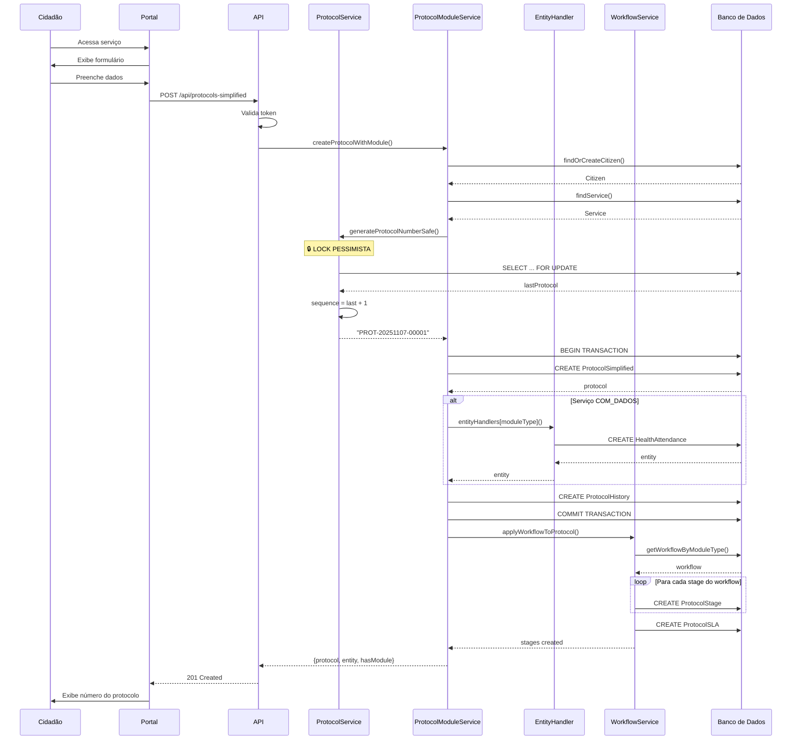
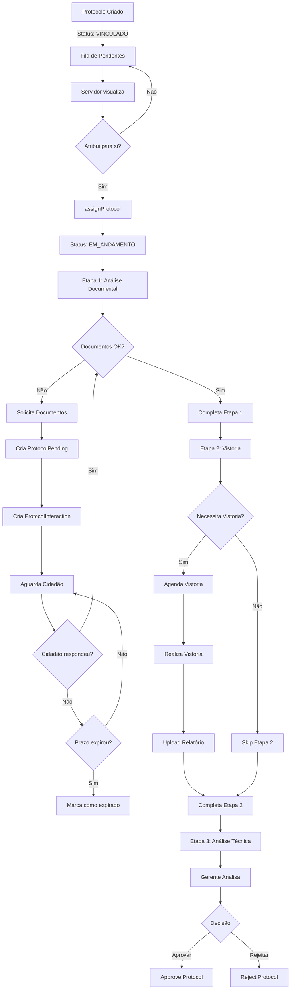
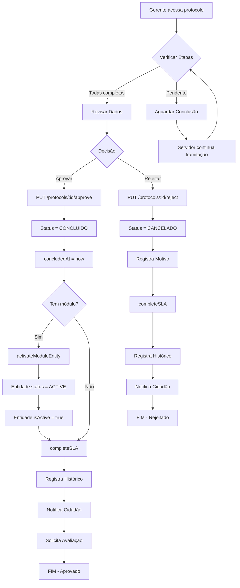
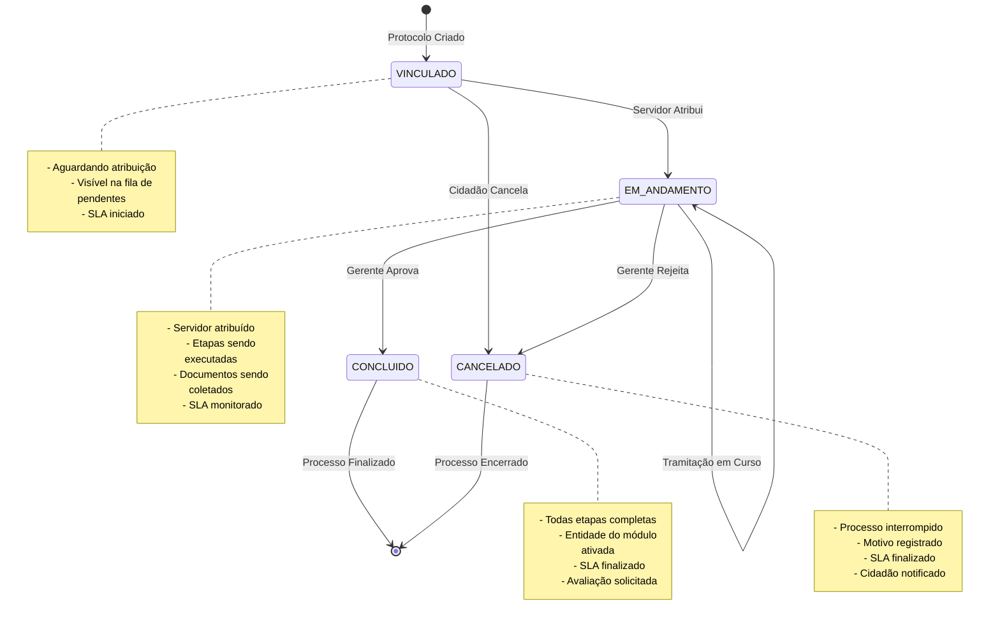
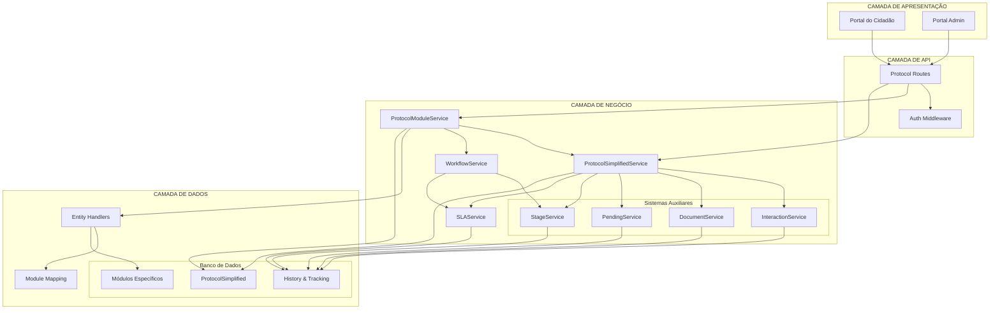
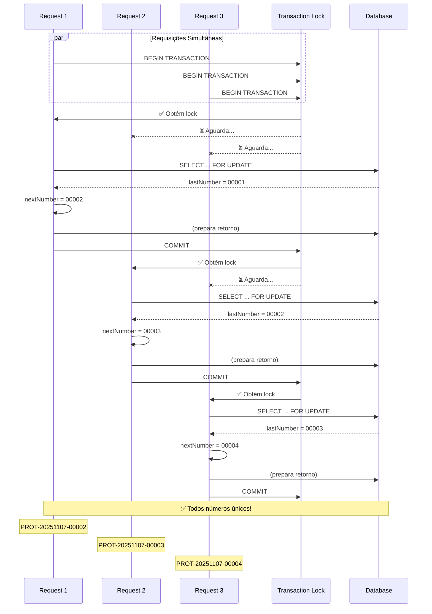
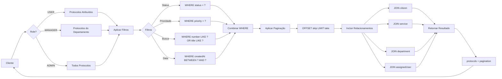
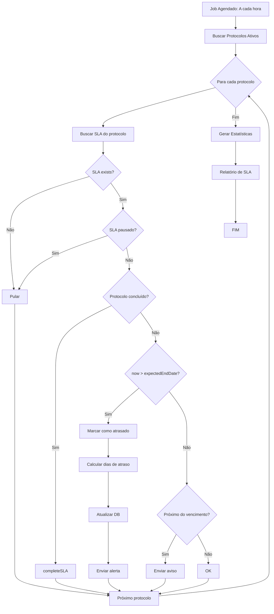
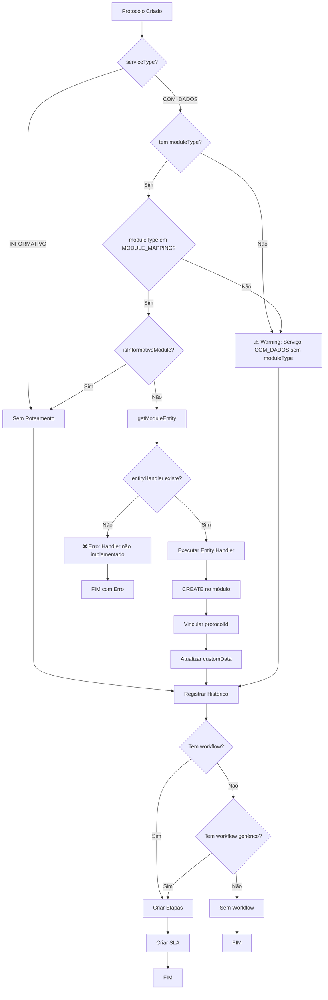

# 📊 FLUXOGRAMAS - Motor de Protocolos

## Índice
1. [Fluxo de Criação de Protocolo](#fluxo-de-criação-de-protocolo)
2. [Fluxo de Tramitação](#fluxo-de-tramitação)
3. [Fluxo de Aprovação/Rejeição](#fluxo-de-aprovaçãorejeição)
4. [Diagrama de Estados](#diagrama-de-estados)
5. [Arquitetura de Componentes](#arquitetura-de-componentes)

---

## 📝 Fluxo de Criação de Protocolo

---

## 🔄 Fluxo de Tramitação

---

## ✅ Fluxo de Aprovação/Rejeição

---

## 🔄 Diagrama de Estados

---

## 🏗️ Arquitetura de Componentes

---

## 📊 Fluxo de Geração de Número (Com Proteção)

---

## 🔍 Fluxo de Consulta de Protocolos

---

## 📈 Monitoramento de SLA

---

## 🎯 Decisões de Roteamento

---

**Última atualização**: 07/11/2025
**Versão**: 2.0.0
